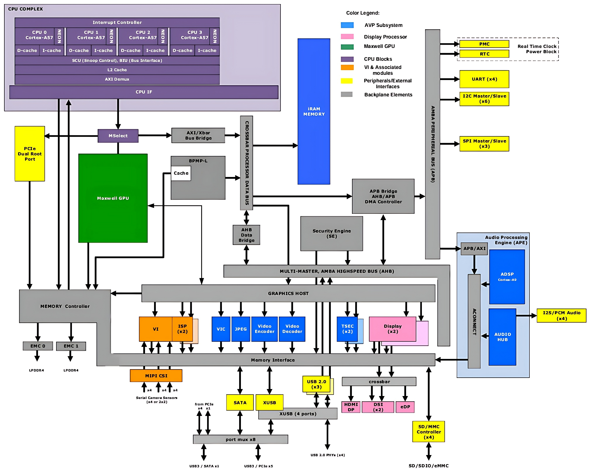
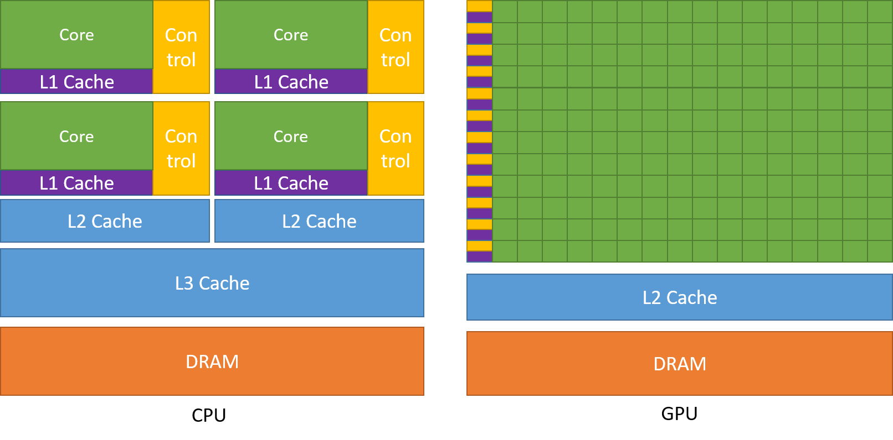

---
---

# Chip Tegra X1 en la Jetson Nano

La **Jetson Nano** está impulsada por el **Tegra X1**, un **System-on-Chip (SoC)** diseñado por NVIDIA para ofrecer una combinación eficiente de rendimiento gráfico, procesamiento general y bajo consumo energético. Su arquitectura integra una CPU ARMv8 de cuatro núcleos y una GPU basada en la arquitectura **Maxwell**, ideal para aplicaciones en visión computacional, robótica y deep learning embebido.

---
---

## Descripción General del Tegra X1

El **Tegra X1** integra varios subsistemas especializados dentro de un único chip, permitiendo ejecutar múltiples tareas paralelas y multimedia de forma eficiente. Estos componentes trabajan de manera colaborativa, desde la CPU general hasta bloques dedicados como el procesador de señal de imagen (ISP) o el codificador de video.

- **CPU**: ARM Cortex-A57 (Quad-Core) de 64 bits.
- **GPU**: Arquitectura Maxwell con hasta 256 núcleos CUDA (128 activos en Jetson Nano, los cuales corresponden a un único SMX (Streaming Multiprocessor), en contraste con los 2 SMX disponibles en el diseño completo del Tegra X1.).
- **Memoria**: LPDDR4, hasta 4 GB, 64-bit de ancho de banda.
- **Subsistema de video**: Aceleración por hardware para codificación/decodificación de video 4K.
- **Procesador de imagen (ISP)**: Procesamiento de cámaras en crudo (RAW).
- **Interfaces**: USB 3.0, HDMI, I2C, SPI, UART, PCIe, SATA, SD/eMMC.
- **Seguridad**: Arranque seguro, cifrado AES por hardware, TrustZone.
- **Gestión energética**: Power gating, DVFS, monitoreo térmico integrado.

> **Nota:** La versión usada en Jetson Nano es la variante **T210**, con frecuencias y recursos adaptados para un consumo reducido.

---
---

## CPU: ARM Cortex-A57

La CPU de cuatro núcleos ARM Cortex-A57 ofrece un rendimiento sólido para tareas generales del sistema operativo, controladores, y aplicaciones. Cada núcleo cuenta con cachés L1 separadas y una caché L2 compartida de 2 MB.

Además de su arquitectura de 64 bits, incorpora extensiones SIMD(Single Instruction, Multiple Data) mediante **NEON**, optimizando tareas vectoriales como el procesamiento de audio e imagen. Incluye también unidades para monitoreo de rendimiento y coherencia de caché a través de su **SCU (Snoop Control Unit)**.

- **Núcleos**: 4 cores de arquitectura ARMv8.
- **Frecuencia**: Hasta 1.43 GHz (limitado en Jetson Nano por gestión térmica).
- **Cachés**:
  - L1: 48 KB de instrucciones + 32 KB de datos por núcleo.
  - L2: 2 MB compartidos.
- **Soporte SIMD**: NEON para procesamiento vectorial.
- **Gestión de coherencia**: Unidad SCU (Snoop Control Unit) para mantener la coherencia entre cachés.
- **Monitoreo**: Unidad PMU (Performance Monitoring Unit) integrada.

> **Nota:** La CPU es responsable de tareas generales del sistema: control del SO, gestión de periféricos, y coordinación de la GPU.

---
---

## GPU: Arquitectura Maxwell

El corazón gráfico del Tegra X1 es una GPU basada en la arquitectura Maxwell, con hasta 256 núcleos CUDA en su versión completa. En la Jetson Nano, se habilitan únicamente 128 núcleos CUDA, permitiendo ejecutar tareas de **GPGPU** (computación en GPU) como inferencia de redes neuronales, filtros de visión computacional o simulaciones científicas.

También ofrece soporte para tecnologías gráficas modernas como **Vulkan 1.0**, **OpenGL 4.5**, **DirectX 12** y procesamiento en **punto flotante de 16 bits (FP16)**, lo cual favorece el rendimiento en IA y tareas embebidas.

- **Arquitectura**: Maxwell de NVIDIA.
- **Núcleos CUDA**: 256 en el diseño completo, 128 activos en la Jetson Nano.
- **Frecuencia**: Aproximadamente 921 MHz.
- **Tecnologías soportadas**:
  - CUDA 7.0 (con soporte para FP16, sin Tensor Cores).
  - Vulkan 1.0, OpenGL 4.5, OpenGL ES 3.1, DirectX 12.
  - GPGPU (cómputo general en GPU).

---
---

## Procesamiento Multimedia

El Tegra X1 no solo se limita a la CPU y GPU: incluye un **subsistema multimedia especializado** para codificación y decodificación de video, con soporte para:

- **NVDEC**: decodificación por hardware de formatos como H.264, H.265/HEVC, VP8, VP9 y MPEG-2, soportando hasta 4K a 60 fps.
- **NVENC**: codificación en tiempo real en resoluciones hasta 4K a 30 fps o Full HD a 120 fps.
- **JPEG**: aceleración para procesamiento de imágenes, logrando velocidades de hasta 600 megapíxeles por segundo.
- **VIC (Video Image Compositor)**: mezcla de capas de video, escalado, rotación y composición en tiempo real para interfaces gráficas o flujos múltiples de cámaras.

---
---

## Procesador de Señal de Imagen (ISP)

El **Jetson Nano**, mediante su SoC **Tegra X1 (T210)**, incorpora un **procesador de señal de imagen (ISP)** capaz de realizar tareas como **demosaicing**, **corrección de color** y **conversión de imágenes RAW a YUV**, descargando estas operaciones de la CPU y la GPU.

En el diseño del módulo Nano, es posible conectar **hasta dos cámaras** mediante interfaces **MIPI CSI-2**, configurables como **1×4** o **2×2 lanes**. El ISP soporta sensores de hasta **24 MP** y puede procesar imágenes a una tasa de hasta **1400 megapíxeles por segundo**.

Aunque el Tegra X1 completo admite hasta **6 interfaces CSI-2**, esta capacidad está limitada en la Jetson Nano por su diseño físico y la placa portadora utilizada.

> **Nota:** El número de cámaras soportadas también depende del software, drivers y la configuración del sistema.

| Término / Sigla | Función breve                                                                       |
| --------------- | ----------------------------------------------------------------------------------- |
| **ISP**         | Procesa imágenes en crudo desde sensores (RAW) antes de su uso o visualización.     |
| **MIPI CSI-2**  | Estándar para transmitir datos de cámara de forma eficiente y rápida al procesador. |
| **Demosaicing** | Reconstruye imágenes a color desde sensores que capturan un solo canal por píxel.   |
| **RAW a YUV**   | Convierte datos crudos de cámara a un formato estándar de video.                    |

---
---

## Memoria y Almacenamiento

El controlador de memoria integrado en el **módulo Jetson Nano** opera con **4 GB de LPDDR4** distribuidos en una interfaz de **4 canales × 16 bits** hasta **1600 MHz**, ofreciendo un ancho de banda teórico de **25,6 GB/s**. Este controlador prioriza accesos críticos y busca optimizar uso de memoria y latencia.

Para el almacenamiento:

- En módulos de tipo “compute” y algunas versiones comerciales, puede contar con **eMMC 5.1** integrada como almacenamiento interno.
- En el **Developer Kit**, el almacenamiento principal es mediante **tarjeta microSD**.
- Aunque se puede configurar para que el sistema operativo use almacenamiento conectado por USB, esto no es parte de la configuración estándar del módulo según especificaciones oficiales.

---
---

## Interfaces de Entrada/Salida

El Tegra X1 tiene gran cantidad de interfaces disponibles:

- **USB**:
  - 3x USB 3.0 (host), 3x USB 2.0.
  - Soporte USB Device.
- **PCIe**: 5 líneas (x1 + x4).
- **UART**: 4 puertos.
- **SPI**: 3 puertos.
- **I2C**: 6 canales.
- **I2S**: Para audio digital (modo TDM multicanal).
- **HDMI 2.0 / DisplayPort / eDP / MIPI-DSI**: hasta 4096x2160 a 60 Hz.

> **Nota:** En la Jetson Nano, algunas de estas conexiones no están disponibles dependiendo del modelo o placa base usada.

---
---

## Subsistema de Audio

El audio es manejado por un procesador ARM Cortex-A9 independiente (hasta 844 MHz), capaz de mezclar múltiples canales de entrada/salida y realizar conversión de tasa de muestreo.

Soporta formatos digitales como I2S, PCM y TDM, lo que permite integrar soluciones de audio multicanal en tiempo real.

---
---

## Seguridad y Protección de Contenido

El Tegra X1 integra mecanismos robustos de seguridad:

- **Boot seguro** con validación criptográfica.
- **Aceleración por hardware** para AES, SHA y RSA.
- **TrustZone** para aislamiento de memoria y periféricos.
- **HDCP** y regiones protegidas de memoria para contenido DRM.

Esto lo convierte en una opción viable para entornos donde la protección de datos es fundamental, como automoción o dispositivos IoT.

---
---

## Gestión Energética

Pensado para sistemas embebidos, el Tegra X1 optimiza el consumo mediante:

- **Clock & Power Gating**: desactiva bloques inactivos.
- **DVFS**: ajusta frecuencia y voltaje dinámicamente.
- **Estados energéticos inteligentes**: ACTIVE, IDLE, SLEEP, DEEP SLEEP.
- **Sensores térmicos integrados** para evitar sobrecalentamiento mediante *throttling* automático.

---
---

## Aplicaciones Típicas

Gracias a su capacidad de procesamiento paralelo, eficiencia energética y versatilidad de interfaces, el Tegra X1 se puede utilizar ampliamente en:

- Robótica autónoma y drones.
- Análisis de video inteligente (IVA).
- Proyectos de visión artificial embebida.
- Dispositivos médicos, automoción y Smart Cities.
- Desarrollo de algoritmos CUDA en dispositivos de borde.

---
---

## Referencias y Recursos recomendados

- [Tegra X1 Data Sheet (PDF)](../PDF/TegraX1_Embedded_DataSheet_DS07224007v1.0.pdf)
- [Jetson Nano Developer Kit](https://developer.nvidia.com/embedded/jetson-nano-developer-kit)
- [NVIDIA CUDA Toolkit](https://developer.nvidia.com/cuda-toolkit)

---
---
