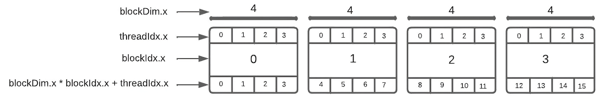

---
---

# Introducción a CUDA en la Jetson Nano

**CUDA (Compute Unified Device Architecture)** es una plataforma de computación paralela desarrollada por NVIDIA, diseñada para aprovechar la capacidad de procesamiento masivo de las GPUs en aplicaciones intensivas en cálculo.

Permite programar directamente la GPU mediante extensiones de C/C++, lo que facilita la creación de funciones denominadas **kernels**, ejecutadas en paralelo por miles de hilos de forma eficiente.

---
---

## Organización y ejecución en CUDA

CUDA organiza la ejecución jerárquicamente en tres niveles: **grids**, **bloques** e **hilos**. Esta estructura es clave para distribuir la carga de trabajo de manera escalable y eficiente.

A continuación, se presentan los conceptos clave para comprender esta organización:

- **Grid (Grilla):** Conjunto de bloques.
- **Block (Bloque):** Grupo de hilos que comparten memoria local y pueden sincronizarse.
   > Internamente, **los bloques se dividen en warps de 32 hilos** y si la cantidad de hilos por bloque **no es múltiplo de 32**, el último warp tendrá hilos inactivos.
- **Thread (Hilo):** Hilo individual que ejecuta una instancia del kernel.
   > Cada hilo realiza una porción específica del trabajo, como si ejecutara su propio código.
- **Warp:** Grupo de 32 hilos fijos que se ejecutan simultáneamente como una unidad en la GPU, esto esta definido por la arquitectura de NVIDIA.
   > CUDA organiza los hilos en *warps* para que se ejecuten de forma eficiente, es decir que si se requiere un hilo solamente, CUDA dejara activará un núcleo y los otros 31 del warp permanecerán inactivos.

- **Kernel:** Función que se ejecuta en la GPU.
   > Cuando se lanza un kernel, **todos los hilos lo ejecutan en paralelo**, cada uno sobre diferentes datos, lo que permite aprovechar al máximo los recursos de la GPU.

- **Núcleo CUDA:** Unidad física dentro de la GPU responsable de ejecutar hilos. Cada núcleo puede ejecutar un hilo a la vez.

> **Nota:** La GPU **no ejecuta hilos individuales uno por uno**, sino en **warps de 32 hilos al mismo tiempo**. Esto es fundamental para entender cómo optimizar la distribución de hilos.

---
---

## Ejecución en la Jetson Nano

Como Jetson Nano está basada en la arquitectura Maxwell, posee **1 SM (Streaming Multiprocessor)** con **128 núcleos CUDA**. Esto permite ejecutar, hasta **4 warps en paralelo** (4 × 32 = 128 hilos simultáneamente). Los warps adicionales se colocan en cola y se ejecutan a medida que los recursos se liberan.

---

### Comando para obtener información sobre el chip de la Jetson Nano

Para acceder a información detallada de la GPU relacionada con CUDA, se puede utilizar el comando `deviceQuery`, incluido en el CUDA Toolkit.

Desde la terminal, es necesario asegurarse de que el CUDA Toolkit esté instalado. Luego, se debe navegar al directorio correspondiente y compilar/ejecutar las siguientes lineas:


```bash
cd /usr/local/cuda/samples/1_Utilities/deviceQuery

sudo make

./deviceQuery
```

Este comando debería mostrar información similar a la siguiente:

```bash
...
Detected 1 CUDA Capable device(s)

Device 0: "NVIDIA Tegra X1"
  ...
  ( 1) Multiprocessors, (128) CUDA Cores/MP:     128 CUDA Cores
  ...
  Warp size:                                     32
  Maximum number of threads per multiprocessor:  2048
  Maximum number of threads per block:           1024
  Max dimension size of a thread block (x,y,z): (1024, 1024, 64)
  Max dimension size of a grid size    (x,y,z): (2147483647, 65535, 65535)
  ...
```

A continuación se destacan algunos valores clave:

#### `1. Maximum number of threads per multiprocessor: 2048`

Indica la cantidad máxima de hilos que un **multiprocesador** puede manejar simultáneamente. En la Jetson Nano, al contar con un solo SM, puede ejecutar hasta **2048 hilos** concurrentemente. **Esta asignación es gestionada automáticamente por el hardware**.

#### `2. Maximum number of threads per block: 1024`

Representa el número máximo de hilos que puede contener un solo **bloque**. Superar este límite generará un error de ejecución. **Para usar más de 1024 hilos, es necesario distribuirlos en múltiples bloques**.

#### `3. Max dimension size of a thread block (x,y,z): (1024, 1024, 64)`

Define las dimensiones máximas que puede tener un bloque de hilos en los ejes **X** con **1024 hilos**, **Y** con **1024 hilos** y **Z** con **64 hilos**. Esto define la forma de distribución de los hilos dentro de un bloque.

#### `4. Max dimension size of a grid size (x,y,z): (2147483647, 65535, 65535)`

Establece los tamaños máximos de una **rejilla (grid)**, es decir, la cantidad de bloques en cada dimensión de **2147483647** para  **X** y **65535** para **Y** y **Z**. Aunque estos límites son bastante amplios, en la práctica las dimensiones suelen ser menores, según la aplicación.

---
---

## Modelo de memoria en CUDA

CUDA trabaja con una jerarquía de memorias que influye directamente en el rendimiento de los programas. Comprender cómo se organiza esta memoria es clave para desarrollar kernels eficientes, especialmente en plataformas donde los recursos son más limitados.

---

### Tipos principales de memoria en CUDA

- **Memoria global**
  Es accesible por todos los hilos, pero también es la más lenta. Se usa para datos compartidos entre bloques. Es clave optimizar los accesos (por ejemplo, acceder de forma coalescida) para evitar cuellos de botella.

- **Memoria compartida**
  Disponible solo para los hilos dentro de un bloque. Es mucho más rápida que la global y se usa para guardar datos temporales o permitir colaboración entre hilos. Una buena gestión de esta memoria puede mejorar significativamente el rendimiento.

- **Registros y memoria local**
  Cada hilo tiene sus propios registros, que son ultra rápidos. Sin embargo, si se usan demasiadas variables o arrays grandes, el compilador puede usar memoria local, que se almacena en la memoria global (más lenta). Este comportamiento puede afectar el rendimiento si no se controla.

- **Memoria constante**
  Ideal para datos de solo lectura que no cambian durante la ejecución, como parámetros fijos. Está optimizada para casos donde muchos hilos leen el mismo valor, gracias a su sistema de caché.

- **Memoria de textura y superficie**
  Se usan en aplicaciones específicas como procesamiento de imágenes o visión artificial. Están diseñadas para acceder a datos con patrones espaciales complejos, y ofrecen mejoras en rendimiento en esos contextos.

### Resumen de los Tipos de Memoria

| Tipo de Memoria         | Acceso                  | Velocidad | Uso común                                      |
|-------------------------|-------------------------|-----------|-----------------------------------------------|
| Global                  | Todos los hilos         | Baja      | Datos compartidos entre bloques               |
| Compartida              | Hilos del mismo bloque  | Alta      | Cooperación entre hilos                       |
| Registros               | Individual (por hilo)   | Muy alta  | Variables locales pequeñas                    |
| Local                   | Individual (por hilo)   | Baja      | Variables cuando no caben en registros        |
| Constante               | Todos los hilos         | Alta      | Valores fijos de solo lectura                 |
| Textura / Superficie    | Hilos (lectura espacial)| Media     | Procesamiento de imágenes o visión artificial |


---
---

## Ejemplo práctico: Suma de vectores

Supongamos que se tienen dos vectores `A` y `B` de números, y se quiere obtener un tercer vector `C` donde cada elemento `C[i] = A[i] + B[i]`.

---

### Código CUDA

**Kernel que se ejecutará en la GPU**

```cpp
__global__ void sumar_vectores(float* A, float* B, float* C, int N) {
    int i = blockIdx.x * blockDim.x + threadIdx.x;
    if (i < N) {
        C[i] = A[i] + B[i];
    }
}
```

### En donde:

- `__global__`: indica que esta función se ejecuta en la GPU y es llamada desde la CPU.
- `blockIdx.x`: índice del bloque actual dentro de la grid.
- `blockDim.x`: número de hilos por bloque.
- `threadIdx.x`: índice del hilo dentro del bloque.
- La línea `int i = blockIdx.x * blockDim.x + threadIdx.x;` calcula el índice global del hilo.
- Si `i < N` quiere decir que está dentro del tamaño del vector, realiza la suma.



---

### Código principal que usa este kernel

```cpp
#include <iostream>
#include <cuda_runtime.h>

int main() {
    // Cantidad de elementos
    const int N = 5000;
    size_t size = N * sizeof(float);

    // Reservar memoria en la CPU
    float* h_A = new float[N];
    float* h_B = new float[N];
    float* h_C = new float[N];

    // Inicializar vectores
    for (int i = 0; i < N; i++) {
        h_A[i] = i + 1;
        h_B[i] = 2 * i + 2;
    }

    // Reservar memoria en la GPU
    float *d_A, *d_B, *d_C;
    cudaMalloc(&d_A, size);
    cudaMalloc(&d_B, size);
    cudaMalloc(&d_C, size);

    // Transferir datos a la GPU
    cudaMemcpy(d_A, h_A, size, cudaMemcpyHostToDevice);
    cudaMemcpy(d_B, h_B, size, cudaMemcpyHostToDevice);

    // Configurar grid y blocks
    int threadsPorBloque = 1024;
    int bloquesPorGrid = (N + threadsPorBloque - 1) / threadsPorBloque;

    // Ejecutar kernel
    sumar_vectores<<<bloquesPorGrid, threadsPorBloque>>>(d_A, d_B, d_C, N);

    // Transferir resultados a la CPU
    cudaMemcpy(h_C, d_C, size, cudaMemcpyDeviceToHost);

    // Mostrar algunos resultados
    for (int i = 0; i < 10; i++) {
        std::cout << h_A[i] << " + " << h_B[i] << " = " << h_C[i] << std::endl;
    }

    // Liberar memoria
    delete[] h_A;
    delete[] h_B;
    delete[] h_C;
    cudaFree(d_A);
    cudaFree(d_B);
    cudaFree(d_C);

    return 0;
}
```

> **Nota:** Cuando se utiliza `cudaMallocManaged`, es necesario llamar a `cudaDeviceSynchronize()` después de lanzar el kernel. Esto asegura que la GPU haya terminado de procesar antes de que la CPU acceda a los datos.
En ese caso, `cudaMemcpy` ***sí bloquea* hasta que la GPU termine**, por lo tanto no se necesita `cudaDeviceSynchronize()`.

---

## ¿Cómo se integran CPU y GPU en este ejemplo?

En este flujo, la **CPU** gestiona los datos y lanza el kernel, mientras que la **GPU** ejecuta la operación paralela de suma entre hilos.


---

## Ejecución Paralela y Arquitectura de CUDA

Si hay 5000 elementos y se usan 1024 hilos por bloque:

- Se necesitan `ceil(5000 / 1024) = 5` bloques.

Esto significa que se lanzan **5120 hilos lógicos** en total para sumar los elementos, aunque solo hayan 5000 elementos, en algún punto van a estar **inactivos 120 hilos**, pero como la GPU usa warps, en algún momento habran **3,75 warps inactivos**, es decir **1 warp con 8 hilos activos y 24 hilos inactivos** junto a **3 warps inactivos**.

Sin embargo, la GPU **no ejecuta todos esos hilos al mismo tiempo**. Aquí entra en juego la arquitectura de la Jetson Nano. Donde CUDA organiza los hilos en **warps** de 32 hilos y los ejecuta por partes.

- **Hilos definidos:** 5120 (1024 × 5)
- **Núcleos CUDA disponibles:** 128
- **Warps totales:** 5120 / 32 = 160 warps

La GPU puede ejecutar 4 warps al mismo tiempo (4 × 32 = 128 hilos concurrentes). Una vez que terminan, la GPU carga los siguientes warps y continúa el procesamiento hasta completar todos.

### Resumen de la Ejecución

| Concepto         | Valor     | Descripción                                     |
| ---------------- | --------- | ----------------------------------------------- |
| Hilos (threads)  | 5120      | Uno por cada elemento a procesar                |
| Elementos útiles | 5000      | Cantidad real de datos                          |
| Bloques          | 5         | Cada uno con 1024 hilos                         |
| Warps totales    | 160       | 32 hilos por warp                               |
| Warps eficaces   | 157       | 156 warps + 1 warp parcial con 8 hilos activos  |
| Warps inactivos  | 3         | Ningún hilo activo                              |
| Núcleos CUDA     | 128       | Ejecutan 4 warps simultáneamente (4×32)         |
| Paralelismo real | 128 hilos | El resto se ejecutan en turnos (multiplexación) |

> Aunque solo hay 128 núcleos CUDA, se lanzan más hilos para ocultar la latencia de memoria. Mientras unos hilos esperan, otros pueden ejecutar, mejorando el rendimiento global

---
---

### Uso de Streams en CUDA para Ejecución Paralela de Kernels

En CUDA, los **streams** permiten ejecutar múltiples **kernels** y operaciones de memoria de forma concurrente en la GPU. Cada stream es una cola independiente de tareas que se ejecutan en paralelo si los recursos de la GPU lo permiten, mejorando la eficiencia y el rendimiento.

#### ¿Qué son los Streams?

Un **stream** es un canal para ejecutar operaciones de manera secuencial. Cuando usamos varios streams, diferentes tareas (como kernels o transferencias de memoria) pueden ejecutarse en paralelo, maximizando la utilización de los recursos de la GPU.

#### **Creación y Uso de Streams**

**1. Crear Streams**:

   ```cpp
   cudaStream_t stream1, stream2;
   cudaStreamCreate(&stream1);
   cudaStreamCreate(&stream2);
   ```

**2. Lanzar Kernels en Streams**:
   Los kernels se lanzan en streams específicos, permitiendo que se ejecuten en paralelo:

   ```cpp
   kernel1<<<bloquesPorGrid, threadsPorBloque, 0, stream1>>>(d_A);
   kernel2<<<bloquesPorGrid, threadsPorBloque, 0, stream2>>>(d_B);
   ```

**3. Sincronización**:
   Para asegurarse de que todos los kernels hayan terminado antes de continuar, se utiliza:

   ```cpp
   cudaStreamSynchronize(stream1);
   cudaStreamSynchronize(stream2);
   ```

**4. Liberación de Streams**:
   Finalmente, liberamos los streams cuando ya no son necesarios:

   ```cpp
   cudaStreamDestroy(stream1);
   cudaStreamDestroy(stream2);
   ```

---

### Flujo de Trabajo

Los **streams** permiten ejecutar varias tareas en la GPU de manera simultánea, lo que ayuda a reducir el tiempo en que la GPU está inactiva. Gracias a los streams, puedes ejecutar varios **kernels** a la vez y también transferir datos mientras las operaciones de cálculo están en curso. Esto asegura que la GPU esté siempre ocupada y trabajando de manera más eficiente, sin perder tiempo esperando.

---
---

### Ventajas de este Enfoque

Al aprovechar tanto la **CPU** como la **GPU** de manera eficiente, se obtienen varios beneficios clave:

- **Velocidad:** Gracias a la capacidad de la GPU para procesar miles de elementos en paralelo, las tareas que requieren un alto volumen de cálculos, como el procesamiento de imágenes o la inferencia de redes neuronales, se aceleran considerablemente.

- **Escalabilidad:** No importa si trabajas con vectores pequeños o grandes; el código CUDA sigue siendo eficiente. Al usar los mismos kernels, la plataforma escala sin necesidad de modificaciones complicadas.

- **Uso eficiente del hardware:** Cada componente del sistema (CPU y GPU) realiza tareas para las que está mejor optimizado, maximizando el rendimiento general de la Jetson Nano.

- **Paralelismo oculto:** Aunque hay más hilos que núcleos CUDA disponibles, la arquitectura de warps asegura que la ejecución sea eficiente. La planificación de estos warps permite que la GPU maneje múltiples hilos de manera óptima, maximizando el paralelismo sin saturar el hardware.

---
---

## Referencias y Recursos recomendados

- [Documentación oficial de CUDA](https://docs.nvidia.com/cuda/)
- [Guía de Programación CUDA C++](https://docs.nvidia.com/cuda/cuda-c-programming-guide/index.html)
- [Guía de desarrollo Jetson Nano](https://developer.nvidia.com/embedded/jetson-nano-developer-kit)
- [CUDA Samples en GitHub](https://github.com/NVIDIA/cuda-samples)
- [CUDA by Example (libro gratuito)](https://developer.nvidia.com/cuda-example)

---
---
